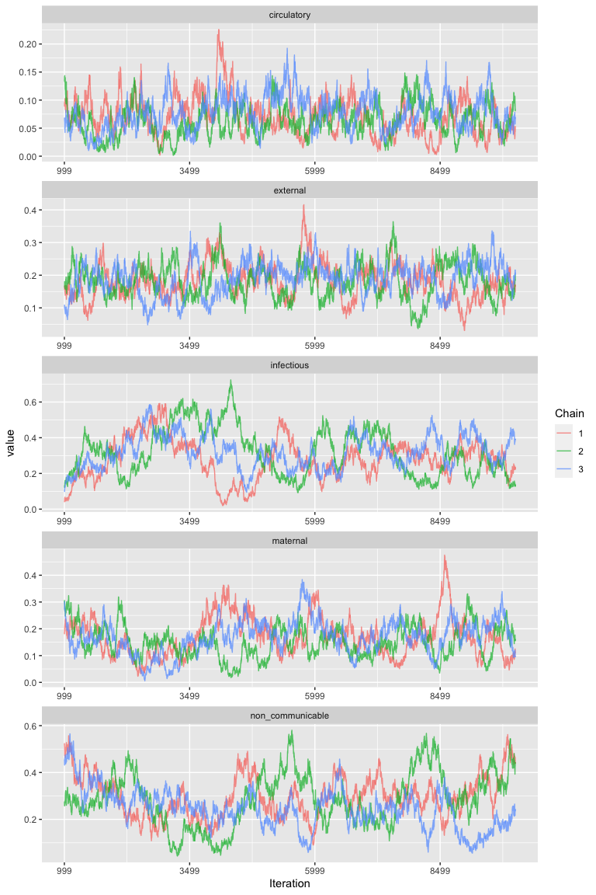

# CalibratedVA

<!-- badges: start -->

[](https://travis-ci.com/jfiksel/CalibratedVA)
<!-- badges: end -->

## Installation

Before installation of CalibratedVA, we recommend first installing the
latest version of LaplacesDemon from [GitHub](https://github.com/):

``` r
# install.packages("remotes")
remotes::install_github("LaplacesDemonR/LaplacesDemon")
```

You can then install the development version of CalibratedVA from
[GitHub](https://github.com/) with:

``` r
# install.packages("remotes")
remotes::install_github("jfiksel/CalibratedVA")
```

## Getting started with CalibratedVA

### PHMRC Data

The Population Health Metrics Research Consortium (PHMRC) study contains
gold-standard cause-of-death (GS-COD) data for children, neonates and
adults in 4 countries, making it a perfect dataset to demonstrate the
merits of `CalibratedVA`.

We have used the openVA package to obtain cause-of-death predictions for
adult deaths from Tanzania. Both InSilicoVA and Tariff were trained
using deaths from the other 3 countries. We obtained individual cause
probability predictions from InSilicoVA and individual top
cause-of-death predictions from Tariff. We will also read in the GS-COD
for each death from Tanzania.

``` r
library(CalibratedVA)
data("insilico_tanzania")
data("tariff_tanzania")
data("gs_cod_tanzania")
```

There are 34 causes, which is too many causes for CalibratedVA to be
useful. We will map these causes to broader causes, using the following
cause map.

``` r
data("phmrc_adult_cause_map")
```

To map the causes, we can provide either the probability
matrix:

``` r
insilico_tanzania <- map_causes(insilico_tanzania, phmrc_adult_cause_map)
```

Or the character vector with the predicted cause or GS-COD for each
individual

``` r
tariff_tanzania <- map_causes(tariff_tanzania$cause, phmrc_adult_cause_map)
gs_cod_tanzania <- map_causes(gs_cod_tanzania, phmrc_adult_cause_map)
```

### Single algorithm predictions

We will first run CalibratedVA using the Tariff predictions. To run
CalibratedVA, we will first select a set of individuals to be in our
“hospital” set–that is, individuals for whom we know their GS-COD.
These individuals will be used for estimation of algorithm
misclassification rates. We will simply use the first 200 individuals
from the data. We will use the default settings for all hyperparameter
values.

``` r
causes <- colnames(tariff_tanzania)
tariff_calibratedva <- calibratedva(va_unlabeled = tariff_tanzania[-(1:200),],
                                    va_labeled = tariff_tanzania[1:200,],
                                    gold_standard = gs_cod_tanzania[1:200,],
                                    causes = causes,
                                    nchains = 3,
                                    ndraws = 10000,
                                    burnin = 1000,
                                    alpha = 10)
```

We can use the `ggmcmc` package to obtain CSMF estimates for the
individual causes, along with credible intervals.

``` r
library(ggmcmc)
P <- data.frame(
  Parameter=paste0("p[", 1:length(causes), "]"),
  Label=causes)
tariff_csmf_samples <- ggs(tariff_calibratedva$samples, par_labels=P, family="p")
#> Warning: `tbl_df()` is deprecated as of dplyr 1.0.0.
#> Please use `tibble::as_tibble()` instead.
#> This warning is displayed once every 8 hours.
#> Call `lifecycle::last_warnings()` to see where this warning was generated.
### CSMF with credible intervals
tariff_csmf <-
  tariff_csmf_samples %>%
  group_by(Parameter) %>%
  summarise(csmf = mean(value),
            ci_L = quantile(value, .025),
            ci_U = quantile(value, .975))
#> `summarise()` ungrouping output (override with `.groups` argument)
tariff_csmf 
#> # A tibble: 5 x 4
#>   Parameter         csmf   ci_L  ci_U
#>   <fct>            <dbl>  <dbl> <dbl>
#> 1 circulatory      0.122 0.0374 0.241
#> 2 external         0.137 0.0323 0.302
#> 3 infectious       0.301 0.0740 0.578
#> 4 maternal         0.187 0.0417 0.377
#> 5 non_communicable 0.253 0.0436 0.513
```

We can also view the
traceplot

``` r
ggs_traceplot(tariff_csmf_samples)
```


And a posterior density
plot

``` r
ggs_density(tariff_csmf_samples)
```


### Using predictions from multiple algorithms (ensemble)

We can use both the predictions from both InSilicoVA and Tariff to
better estimate the CSMF using the ensemble approach. We simply need to
format the predictions into a list of
matrices

``` r
ensemble_unlabeled <- list(tariff_tanzania[-(1:200),], insilico_tanzania[-(1:200),])
ensemble_labeled <- list(tariff_tanzania[1:200,], insilico_tanzania[1:200,])
```

``` r
ensemble_calibratedva <- calibratedva(va_unlabeled = ensemble_unlabeled,
                                      va_labeled = ensemble_labeled,
                                      gold_standard = gs_cod_tanzania[1:200,],
                                      causes = causes,
                                      nchains = 3,
                                      ndraws = 10000,
                                      burnin = 1000)
```

``` r
ensemble_csmf_samples <- ggs(ensemble_calibratedva$samples, par_labels=P, family="p")
### CSMF with credible intervals
ensemble_csmf <-
  ensemble_csmf_samples %>%
  group_by(Parameter) %>%
  summarise(csmf = mean(value),
            ci_L = quantile(value, .025),
            ci_U = quantile(value, .975))
#> `summarise()` ungrouping output (override with `.groups` argument)
ensemble_csmf 
#> # A tibble: 5 x 4
#>   Parameter          csmf   ci_L  ci_U
#>   <fct>             <dbl>  <dbl> <dbl>
#> 1 circulatory      0.0703 0.0153 0.137
#> 2 external         0.185  0.0863 0.286
#> 3 infectious       0.306  0.0992 0.552
#> 4 maternal         0.163  0.0473 0.308
#> 5 non_communicable 0.276  0.0896 0.489
```

We can also view the
traceplot

``` r
ggs_traceplot(ensemble_csmf_samples)
```



And a posterior density
plot

``` r
ggs_density(ensemble_csmf_samples)
```


### Additional features

Please view the [“Get
Started”](https://jfiksel.github.io/CalibratedVA/articles/CalibratedVA.html)
tab to see additional features in CalibratedVA.
